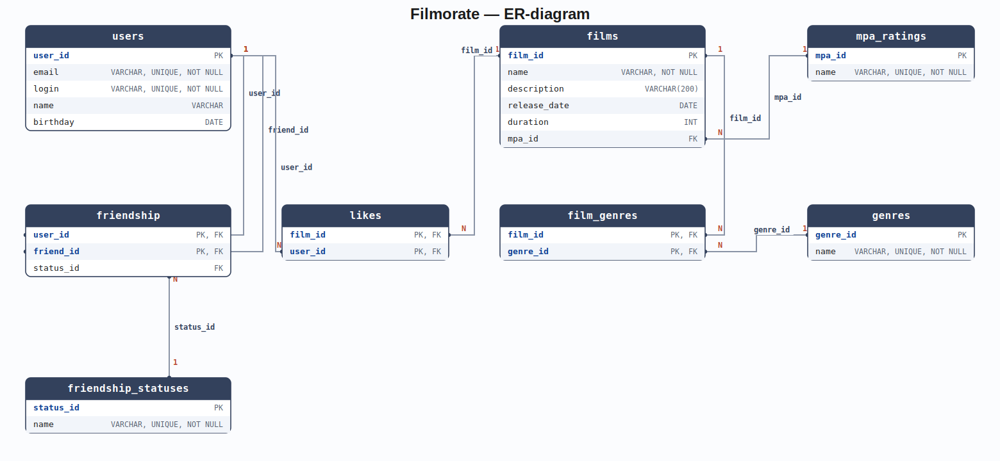

# Filmorate

Backend-приложение для сервиса оценки фильмов: пользователи ставят фильмам лайки,
добавляют друг друга в друзья, а приложение формирует топ самых популярных фильмов.

## Стек

- Java 21, Spring Boot 3.5
- Spring MVC — REST API
- Spring JDBC (`JdbcTemplate`) — доступ к данным
- H2 — встроенная СУБД (файловая в рабочем режиме, резидентная в тестах)
- Maven

## Запуск

```bash
mvn spring-boot:run
```

Приложение поднимается на `http://localhost:8080`. При старте Spring Boot автоматически
выполняет `src/main/resources/schema.sql` (создание таблиц) и `data.sql` (справочники
жанров и рейтингов); файл базы данных сохраняется в `./db/filmorate.mv.db` — данные
переживают перезапуск.

Тесты:

```bash
mvn test
```

Интеграционные тесты хранилищ (`*DbStorageTest`) поднимают отдельную резидентную
(in-memory) БД на каждый тестовый класс и не затрагивают рабочий файл `db/filmorate.mv.db`.

## API

### Пользователи (`/users`)

| Метод | Путь | Описание |
|---|---|---|
| GET | `/users` | все пользователи |
| GET | `/users/{id}` | пользователь по id |
| POST | `/users` | создать пользователя |
| PUT | `/users` | обновить пользователя |
| PUT | `/users/{id}/friends/{friendId}` | добавить друга (односторонне) |
| DELETE | `/users/{id}/friends/{friendId}` | удалить друга |
| GET | `/users/{id}/friends` | список друзей |
| GET | `/users/{id}/friends/common/{otherId}` | общие друзья двух пользователей |

Дружба односторонняя: если `id` добавляет `friendId` в друзья, `friendId` не получает
`id` в свой список автоматически.

### Фильмы (`/films`)

| Метод | Путь | Описание |
|---|---|---|
| GET | `/films` | все фильмы |
| GET | `/films/{id}` | фильм по id |
| POST | `/films` | создать фильм |
| PUT | `/films` | обновить фильм |
| PUT | `/films/{id}/like/{userId}` | поставить лайк |
| DELETE | `/films/{id}/like/{userId}` | снять лайк |
| GET | `/films/popular?count=N` | топ N фильмов по лайкам |

При создании/обновлении фильма достаточно передать id жанров и рейтинга:

```json
{
  "name": "Inception",
  "description": "A mind-bending thriller",
  "releaseDate": "2010-07-16",
  "duration": 148,
  "mpa": {"id": 3},
  "genres": [{"id": 4}, {"id": 6}]
}
```

Сервер сам подставит названия из справочников в ответе и вернёт `404`, если жанр
или рейтинг с таким id не существует.

### Справочники

| Метод | Путь | Описание |
|---|---|---|
| GET | `/genres` | все жанры |
| GET | `/genres/{id}` | жанр по id |
| GET | `/mpa` | все возрастные рейтинги (система MPAA: `G`, `PG`, `PG-13`, `R`, `NC-17`) |
| GET | `/mpa/{id}` | рейтинг по id |

## Схема базы данных



Диаграмма также доступна отдельным файлом: [docs/er-diagram.svg](docs/er-diagram.svg).

### Описание таблиц

- **users** — зарегистрированные пользователи (`user_id`, `email`, `login`, `name`, `birthday`).
- **friendship** — односторонние связи дружбы (`user_id`, `friend_id`, `status_id`). Строка
  `(user_id, friend_id)` означает, что `user_id` добавил `friend_id` в свой список друзей;
  обратная связь появляется только отдельной строкой, если `friend_id` в ответ добавит
  `user_id`. Колонка `status_id` в текущей бизнес-логике не используется (задел под
  подтверждение дружбы, оставленный на будущее) и всегда `NULL`.
- **friendship_statuses** — справочник статусов связи (`status_id`, `name`). Существует
  в схеме как FK-цель для `friendship.status_id`, но приложением сейчас не заполняется
  и не читается.
- **films** — фильмы (`film_id`, `name`, `description`, `release_date`, `duration`, `mpa_id`).
- **mpa_ratings** — справочник возрастных рейтингов MPA (`mpa_id`, `name`): `G`, `PG`, `PG-13`,
  `R`, `NC-17`. Вынесен в отдельную таблицу, так как рейтинг — это ограниченный набор значений,
  общий для многих фильмов.
- **genres** — справочник жанров (`genre_id`, `name`): Комедия, Драма, Мультфильм, Триллер,
  Документальный, Боевик.
- **film_genres** — связывающая таблица «многие ко многим» между `films` и `genres`
  (`film_id`, `genre_id`), так как у одного фильма может быть несколько жанров,
  а у одного жанра — много фильмов.
- **likes** — связывающая таблица «многие ко многим» между `films` и `users`
  (`film_id`, `user_id`): какой пользователь поставил лайк какому фильму.

### Нормализация

Схема приведена к третьей нормальной форме (3NF):

- каждый столбец атомарен — множественные значения (жанры фильма, друзья пользователя,
  лайки) вынесены в отдельные связывающие таблицы, а не хранятся списком в одном столбце;
- все неключевые атрибуты каждой таблицы зависят от полного первичного ключа
  (в составных ключах `friendship`, `film_genres`, `likes` неключевых атрибутов, зависящих
  только от части ключа, нет);
- нет транзитивных зависимостей неключевых атрибутов друг от друга — например,
  название рейтинга MPA и название жанра хранятся один раз в справочных таблицах
  `mpa_ratings` и `genres`, а не дублируются в каждой строке `films`.

## Примеры запросов

Получить всех пользователей:

```sql
SELECT * FROM users;
```

Получить все фильмы вместе с названием рейтинга MPA:

```sql
SELECT f.*, m.name AS mpa_name
FROM films AS f
JOIN mpa_ratings AS m ON m.mpa_id = f.mpa_id;
```

Получить жанры конкретного фильма:

```sql
SELECT g.name
FROM film_genres AS fg
JOIN genres AS g ON g.genre_id = fg.genre_id
WHERE fg.film_id = ?;
```

Топ N самых популярных фильмов по количеству лайков:

```sql
SELECT f.*, COUNT(l.user_id) AS likes_count
FROM films AS f
LEFT JOIN likes AS l ON l.film_id = f.film_id
GROUP BY f.film_id
ORDER BY likes_count DESC
LIMIT ?;
```

Список друзей пользователя:

```sql
SELECT u.*
FROM friendship AS fr
JOIN users AS u ON u.user_id = fr.friend_id
WHERE fr.user_id = ?;
```

Список общих друзей двух пользователей:

```sql
SELECT u.*
FROM friendship AS fr1
JOIN friendship AS fr2 ON fr2.friend_id = fr1.friend_id
JOIN users AS u ON u.user_id = fr1.friend_id
WHERE fr1.user_id = ?
  AND fr2.user_id = ?;
```
